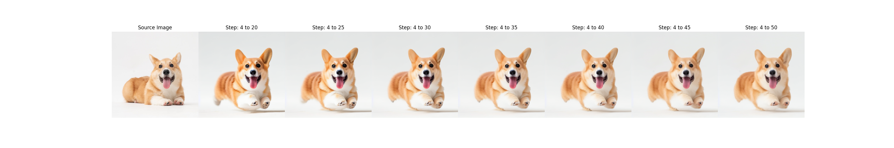
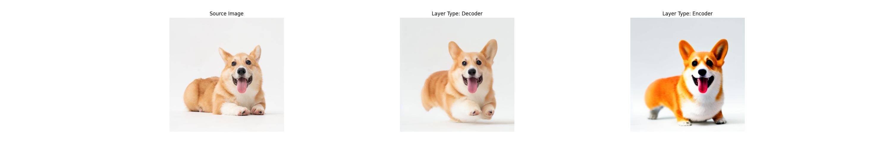
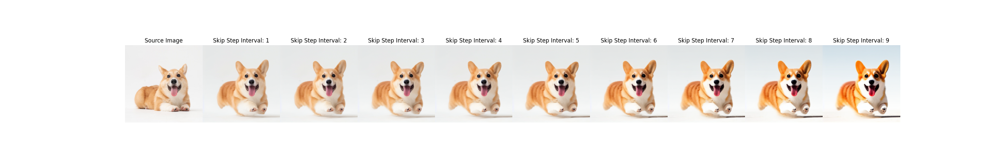
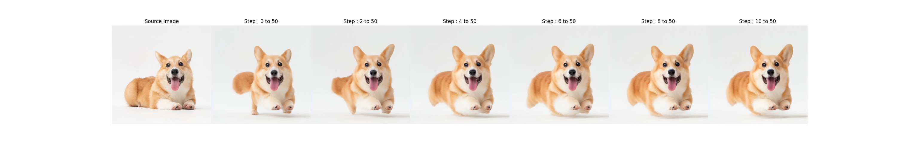
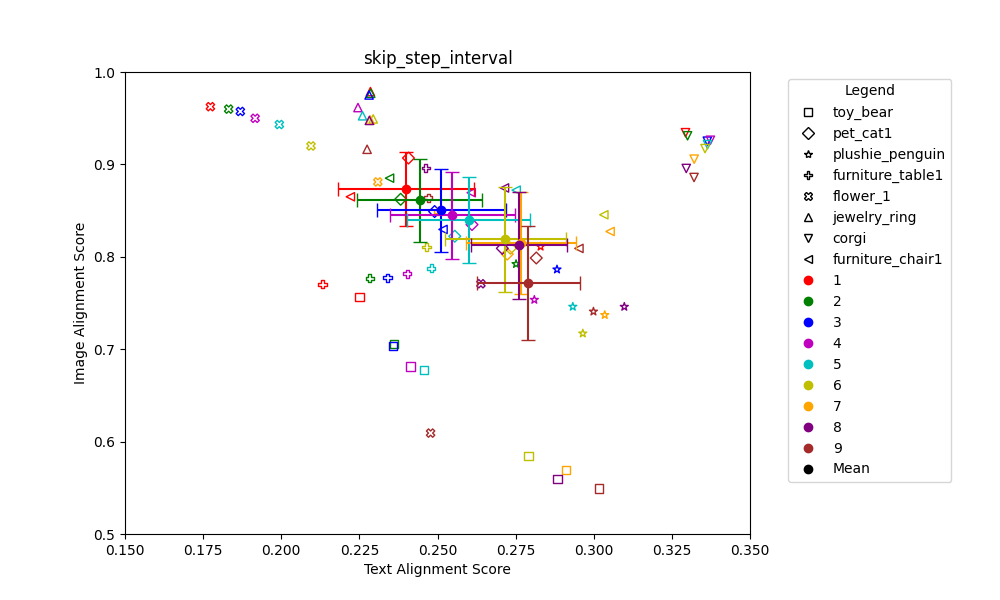
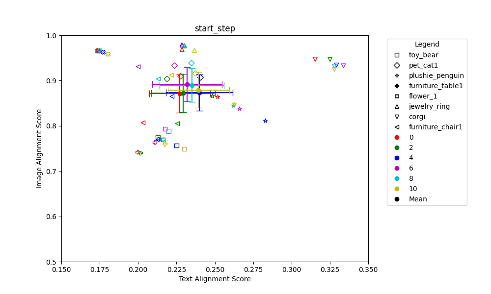

# Consistent Image Synthesis for T2I Personalization 

**📢2024년 여름 [AIKU](https://github.com/AIKU-Official) 활동으로 진행한 프로젝트입니다.**

**🎉2024년 여름 AIKU Conference 열심히상 수상!**

## 소개

본 프로젝트는 
T2I personalization task는 사용자 제공 reference image를 기반으로 T2I diffusion 모델을 사용자 맞춤화하는 것입니다. 몇 장의 reference image와 text prompt를 제공하면 다양한 pose, view, background에서 대상의 새로운 렌더링을 생성할 수 있습니다. 기존 접근 방식은 고유한 텍스트 임베딩을 사용하여 대상을 나타내며, 텍스트 임베딩 자체나 확산 모델의 매개변수를 최적화하여 대상을 표현합니다. 그러나 이러한 방법들은 종종 색상, 텍스처 및 모양과 같은 대상의 외관을 정확하게 모방하는 데 실패합니다. 이는 텍스트 임베딩이 대상의 시각적 외관을 표현하는 데 충분한 spatial representation을 가지지 못하기 때문입니다.

## 팀원

| 팀원                            | 역할                                       |
| -------------------------------------- | ---------------------------------------- |
| [김민재](https://github.com/kwjames98)*      | Inference, Code analysis(Textual Inversion),  Paper(Abstract, Introduction, Related Works, Preliminary, Method)  |
| [김민영](https://github.com/EuroMinyoung186)     | Code analysis(Cross attention map), Inference, Evaluation(MasaCtrl), Distributive processing, Paper(Experiments, Conclusion) |
| [지동환](https://github.com/zheedong)                          | Code analysis(Textual Inversion, Cross attention map), Inference, Paper(Reference) |
| [황정현](https://github.com/imjunghyunee)                           | Code analysis(Textual Inversion), Paper(Experiments, Conclusion), Inference |

## 참고 논문

> **Custom Diffusion** [[repo]](https://github.com/adobe-research/custom-diffusion)
>
> _Proposed in [“Multi-Concept Customization of Text-to-Image Diffusion”](https://arxiv.org/abs/2212.04488),
> CVPR 2023

> **MasaCtrl** [[repo]](https://github.com/TencentARC/MasaCtrl)
>
> _Proposed in [“MasaCtrl: Tuning-Free Mutual Self-Attention Control for Consistent Image Synthesis and Editing”](https://arxiv.org/abs/2304.08465),
> ICCV 2023

### MasaCtrl Architecture

    

## 방법론 1: Cross Attention Map 

    

MasaCtrl은 layout 형성을 위해 S step 이후 denoising U-Net decoder 의 L layer의 cross attention map 을 average 한 16x16xN textual token correlated attention map을 얻은 후, N에 대해서 average 를 통해 16x16 attention map을 얻습니다. 그 후 pixel 별로 thresholding 해서 masked-guided mutual self attention을 위한 foreground/background binary mask를 생성합니다. 저희는 Encoder부분에서 또는 Decoder부분에서, 그리고 Encoder나 Decoder의 일부 cross attention map을 추출하는 방법을 통해 cross attention map이 이미지 생성에 끼치는 영향 비교했습니다. 

## 방법론 2: Denoising Step and layer

방법론 1에서 Decoder가 Encoder보다 Consistency 유지를 잘하고, 실제 CLIP 기반 score에서도 점수가 높았습니다. 하지만 Encoder가 Text alignment에서는 좋은 성능을 보였습니다.
또한 Encoder의 정보를 가져와서 합치면, source에서 가려진 부분을 추론해서 만들어내는 능력을 보였고, Decoder에는 그 부분이 삭제되서 보였습니다. 이는 생성을 하는 Decoder의 과정에서 Key Value로 source를 쓰다보니, 생성할 때 오히려 원본에 대한 정보만이 강력하게 들어가는 것으로 판단했습니다.

그에 대한 해결책으로 Step을 4부터 50이 아니라 4부터 20 / 4부터 25 등 최종 step을 줄여주었습니다. Encoder를 활용하면 잘리는 부분이 없겠지만, Consistency가 유지되지 못하기 때문에 사용하기 힘들어 보였고, Decoder를 사용하면서 최대한 잘리는 부분이 없게 만들려면 계속해서 mutual self attention을 할 게 아니라 어느 정도까지는 mutual self attention을 주고, 그 이후로는 Text conditional만 영향을 주게하면, 초기에 source와 같은 형태로 세팅을 해주어 text에 의존하여 만들 수 있게 되지 않을까란 생각에서 착안했습니다.

## 예시 결과

### final step별 image 차이

#### Encoder와 Decoder별 image 차이

#### step 간격 별 image 차이

#### start step별 image 차이

#### final_step별 text-alignment와 image-alignment 사이의 관계

#### skip_step별 text-alignment와 image-alignment 사이의 관계 

#### start_step별 text-alignment와 image-alignment 사이의 관계 

